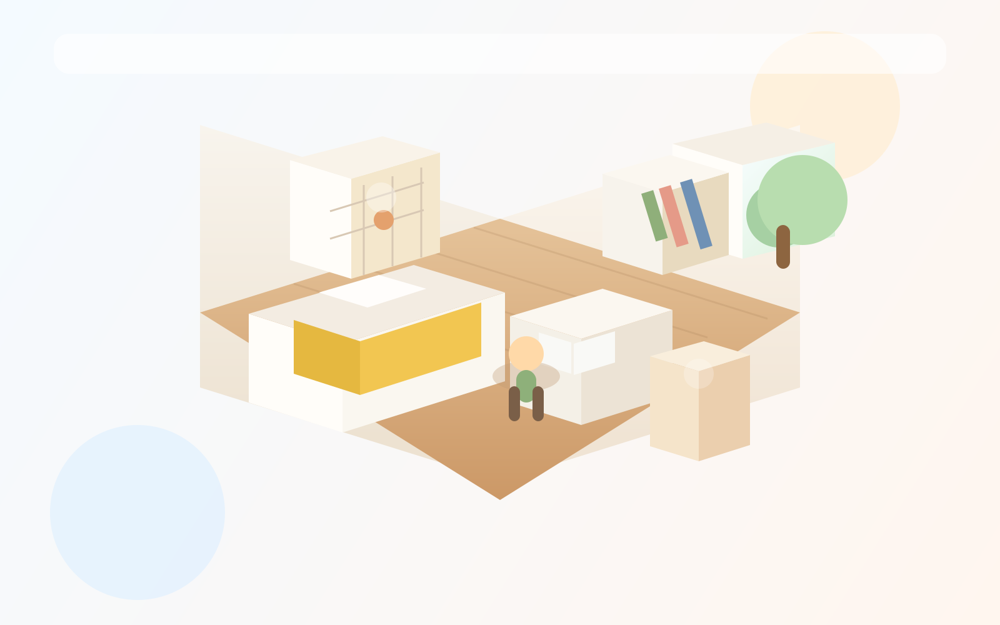
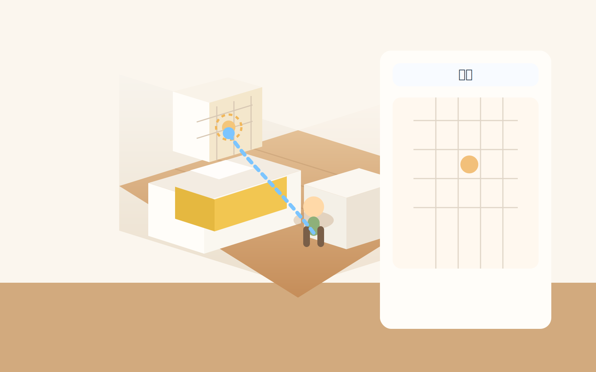
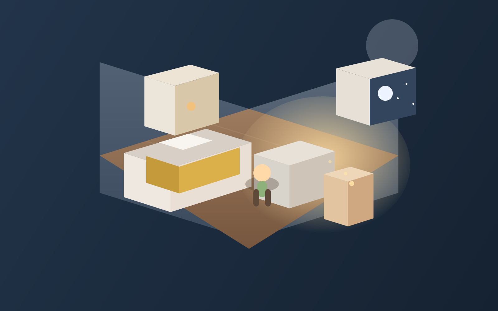

# Healing 3D Hideout Concept

## 1. 최종 해석

아지트 탭은 더 이상 카드형 홈도 아니고,
단순한 2D 미니룸도 아닙니다.

이번 방향은:

`싸이월드 감성의 개인 공간을 3D/2.5D 방으로 만들고, 아바타가 직접 움직여 사물과 상호작용하는 힐링형 아지트`

입니다.

핵심은 세 가지입니다.

- 공간이 메인이다
- 아바타가 직접 움직인다
- 기능은 사물 속에 숨겨진다

즉 사용자는 아지트 탭에 들어가면

- 방 안으로 들어오고
- 아바타를 움직이며
- 달력, 시간표, 게시판, 사진 액자 같은 사물에 다가가서
- 기능을 연다

라는 흐름을 경험해야 합니다.

## 2. 이 화면은 어떤 느낌이어야 하는가

톤은 아래 두 축을 섞는 방향이 맞습니다.

### 싸이월드에서 가져올 것

- 나만의 공간이라는 감정
- 아기자기한 장식성
- 취향과 기록이 공간에 스며드는 느낌
- 작은 오브젝트 하나하나에 의미가 있는 구성

### 동물의 숲에서 가져올 것

- 아바타 직접 이동
- 공간을 산책하는 느낌
- 물건과 가까워져 상호작용하는 방식
- 힐링되는 속도감

즉 결과적으로는:

`감성은 싸이월드, 조작은 동물의 숲`

에 가깝습니다.

## 3. 시각 방향

방은 차갑고 현대적인 인터페이스가 아니라,
정서적인 작은 방이어야 합니다.

### 키워드

- 따뜻한 햇살
- 나무 바닥
- 부드러운 벽지
- 작은 조명
- 식물
- 책상과 침대
- 손때 묻은 게시판
- 벽에 걸린 달력
- 잔잔한 배경음

### 그래픽 방향

- 완전 리얼 3D보다는 부드러운 3D 또는 2.5D
- 카툰 렌더
- 둥근 모서리
- 낮은 채도 파스텔
- 소프트 섀도우
- 너무 날카롭지 않은 라이팅

### 피해야 할 것

- HUD가 과한 게임 화면
- 차가운 3D 시뮬레이터 느낌
- 기능 아이콘이 화면 바깥에만 몰려 있는 앱식 인터페이스

## 4. 공간 UX 원칙

## A. 방이 곧 홈 화면

아지트 탭에 들어가면
텍스트 목록이나 카드보다 방이 먼저 보여야 합니다.

권장 요소:

- 카메라는 약간 위에서 내려다보는 3D/아이소메트릭 시점
- 방 전체가 한눈에 보임
- 아바타는 중앙 또는 침대 근처에서 시작
- UI는 최소화

## B. 오브젝트에 의미가 있어야 함

사물은 단순 장식이 아니라 기능 오브젝트여야 합니다.

예:

- 벽 달력 -> 일정
- 시간표 보드 -> 시간표
- 게시판 -> 해야 할 일
- 액자 -> 사진첩
- 오디오 플레이어 -> BGM
- 책상 위 노트 -> 메모

중요:

home 화면에서 텍스트 라벨이 항상 떠 있을 필요는 없습니다.
오브젝트 자체의 모양으로 역할을 이해할 수 있어야 합니다.

## C. 상호작용은 "가까이 가서 확인"이 기본

기능을 여는 방식은 두 가지가 가능합니다.

1. 오브젝트 직접 클릭
2. 아바타가 오브젝트 가까이 자동 이동 후 상호작용

추천 기본 동작:

- 오브젝트를 터치하면
- 아바타가 해당 위치까지 걸어가고
- 도착하면 상호작용 패널이 열린다

이 방식이 좋은 이유:

- 공간을 "쓴다"는 느낌이 생김
- 앱 기능이 게임처럼 느껴짐
- 힐링형 리듬이 생김

## 5. 조작 방식

권장 조작은 아래 둘 중 하나입니다.

### 모바일 기본형

- 탭한 지점으로 아바타 이동
- 오브젝트 탭 시 해당 오브젝트 앞으로 이동
- 도착 후 패널 오픈

### 확장형

- 가상 조이스틱 이동
- 근접 시 상호작용 버튼 등장

1차 MVP는 탭 이동형이 더 현실적입니다.

이유:

- 더 단순하다
- 모바일에 잘 맞는다
- 힐링 리듬을 유지하기 쉽다

## 6. 정보 구조

아지트 탭 안에서 기능은 메뉴가 아니라 사물로 분산됩니다.

즉 기존 앱식 정보 구조:

- 일정 탭
- 할 일 탭
- 사진첩 탭

보다,

공간형 정보 구조:

- 달력에서 일정
- 게시판에서 할 일
- 액자에서 사진첩

이 우선됩니다.

그래도 최소 UI는 필요합니다.

### 최소 UI

- 상단: 방 이름, 편집, 카메라
- 하단: 홈 복귀, 친구/방문자, 설정

하지만 이 UI는 보조이고,
주요 탐색은 공간 안에서 일어나야 합니다.

## 7. 편집 모드

평소에는 힐링 공간처럼 보여야 하고,
편집할 때만 조작 UI가 나와야 합니다.

### 편집 모드 기능

- 가구 배치
- 벽/바닥 변경
- 장식 추가
- 기능 오브젝트 배치
- 오브젝트 교체

### 중요한 점

장식 오브젝트와 기능 오브젝트를 분리해서 관리해야 합니다.

장식:

- 침대
- 조명
- 식물
- 러그
- 인형

기능:

- 달력
- 시간표 보드
- 할 일 게시판
- 사진 액자
- 음악 플레이어

## 8. 패널 열리는 방식

오브젝트와 상호작용하면
다른 앱처럼 화면이 완전히 갈아엎어지면 안 됩니다.

더 자연스러운 방식:

- 방 위에 반투명 패널 오픈
- 우측 슬라이드 패널
- 책상 서랍처럼 열리는 패널 애니메이션

예:

- 달력 클릭 -> 월간 달력 오버레이
- 시간표 보드 클릭 -> 우측에서 시간표 패널
- 게시판 클릭 -> 체크리스트 패널

핵심은:

사용자가 여전히 "내 방 안"에 있다고 느껴야 한다는 점입니다.

## 9. 힐링 감각을 만드는 요소

힐링은 단순히 예쁜 배경으로 생기지 않습니다.
공간의 반응이 부드러워야 합니다.

권장 요소:

- 느린 카메라 이동
- 부드러운 걷기 애니메이션
- 창문 빛 변화
- 잔잔한 먼지 입자
- 조명 반짝임
- 바닥 그림자
- 오브젝트 접근 시 작은 하이라이트

배경음:

- 바람
- 새소리
- 저녁 방 소음
- 잔잔한 피아노

## 10. 권장 MVP

1차에서 필요한 것:

- 방 1종
- 아바타 1종
- 탭 이동형 경로 이동
- 기능 오브젝트 4종
  - 달력
  - 시간표 보드
  - 할 일 게시판
  - 사진 액자
- 편집 모드
- 힐링 톤 라이팅

보류:

- 복수 방
- 복잡한 3D 카메라 회전
- 실시간 방문 멀티플레이
- 과한 HUD

## 11. 목업

### 1. 방 자체가 홈 화면인 장면

### 2. 아바타 이동이 보이는 장면

### 3. 저녁의 힐링 분위기 장면

## 12. 구현 해석

중요한 현실적 구분:

- 이 문서와 SVG는 `컨셉 시안`
- 실제로 3D 공간을 만들려면 `별도 구현`이 필요

즉 지금 이미지는 방향을 정하기 위한 것이고,
실제 제품에서는 진짜 3D 또는 2.5D 런타임 렌더가 들어가야 합니다.

정리하면:

`이 아지트는 화면 안의 메뉴가 아니라, 아바타가 걸어다니며 기능을 여는 힐링 공간`

입니다.
