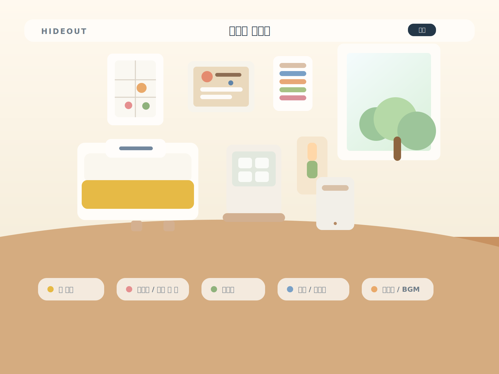
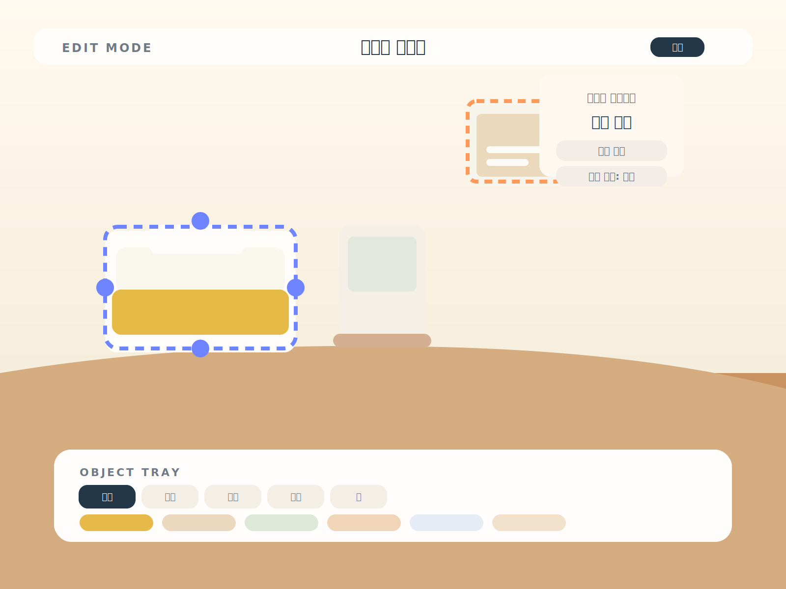
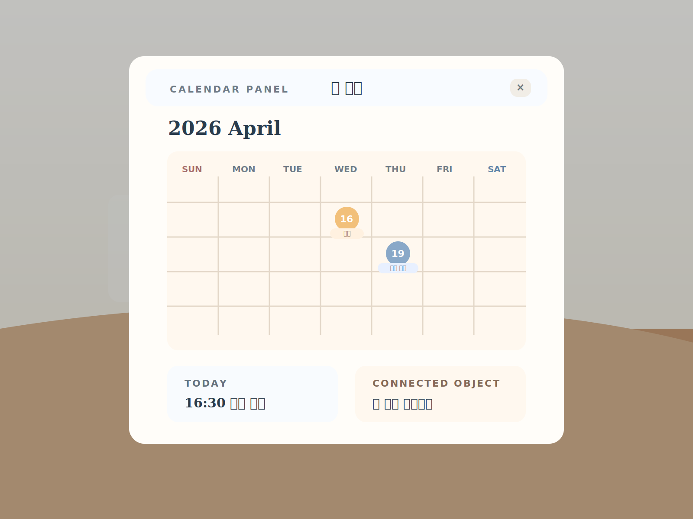

# Interactive Hideout Room Concept

## 1. 수정된 해석

이번 아지트는 `미니홈피 카드`가 아니라,

`방 한 칸이 곧 홈 화면인 인터랙티브 공간`

입니다.

즉 사용자가 아지트 탭에 들어가면:

- 리스트나 카드가 먼저 보이는 것이 아니라
- 나만의 방이 전체 화면으로 바로 보이고
- 방 안의 사물들이 기능 진입점이 됩니다

예:

- 벽 달력 클릭 -> 달력 화면
- 책상 위 시간표 클릭 -> 시간표 화면
- 게시판 클릭 -> 해야 할 일
- 액자 클릭 -> 사진첩
- 오디오 플레이어 클릭 -> BGM

핵심은 `방을 꾸민다`와 `방을 통해 앱 기능을 쓴다`가 하나로 합쳐지는 구조입니다.

## 2. 이 방향이 맞는 이유

이전 제안들이 어긋났던 이유는:

- 방이 메인이라기보다 카드/대시보드가 메인이었고
- 방은 장식처럼 붙어 있었으며
- 기능이 방 안의 오브젝트와 직접 연결되지 않았기 때문입니다

원하는 형태는 훨씬 명확합니다.

`방 자체가 정보 구조`

여야 합니다.

즉 이 탭은 일반 앱 화면이 아니라,

`개인화된 2D 룸 인터페이스`

로 이해해야 합니다.

## 3. 한 줄 제품 정의

싸이월드 미니룸 감성으로 꾸민 나만의 방 안에서, 가구와 소품을 눌러 캘린더, 시간표, 할 일, 사진첩 같은 기능을 여는 아지트 탭

## 4. 핵심 UX 원칙

### 1. 전체 화면 방 우선

아지트 탭 진입 시:

- 상단 헤더를 최소화
- 방이 화면 대부분을 차지
- 첫 인상이 `앱 화면`이 아니라 `내 공간`이어야 함

### 2. 사물이 곧 메뉴

기능 메뉴를 텍스트 리스트로 두기보다,

- 달력 = 일정
- 노트북 = 메시지/메모
- 칠판 = 시간표
- 게시판 = 할 일
- 액자 = 사진첩

처럼 사물과 기능을 1:1 또는 1:N으로 연결합니다.

### 3. 홈과 편집의 분리

- 평소에는 감상/사용 모드
- 편집할 때만 배치/회전/교체 UI 노출

즉 홈에서는 예쁘게 보여야 하고,
편집은 별도 모드에서만 일어나야 합니다.

### 4. 오브젝트 클릭 후 앱 모듈 전환

오브젝트를 누르면:

- 전체 다른 탭으로 튀는 방식보다
- 현재 방 위에 서랍이나 팝업, 패널이 열리는 방식이 더 자연스럽습니다

예:

- 달력 클릭 -> 방 위에 달력 패널 슬라이드 오픈
- 시간표 클릭 -> 우측 패널 또는 모달

## 5. 화면 구조

## A. 기본 홈 화면

구성:

1. 얇은 상단 바
2. 전체 화면 방
3. 아주 최소한의 플로팅 버튼

상단 바:

- 방 이름
- 현재 주인 이름
- 편집 버튼
- 공유 버튼

방 내부:

- 벽
- 바닥
- 침대
- 책상
- 선반
- 포스터
- 달력
- 게시판
- 사진 액자
- 조명
- 캐릭터 또는 아바타

플로팅 버튼:

- 편집
- 카메라
- 방문자 목록

## B. 편집 모드

편집 모드에서는:

- 오브젝트 선택
- 이동
- 회전
- 크기 조정
- 교체
- 제거
- 벽/바닥 테마 변경

하단 트레이:

- 가구
- 학습
- 취미
- 장식
- 벽
- 바닥

여기서 `학습` 같은 카테고리가 중요합니다.
왜냐하면 시간표, 메모보드, 달력도 단순 장식이 아니라 기능 오브젝트이기 때문입니다.

## C. 기능 오픈 상태

오브젝트 클릭 시:

- 방 배경은 유지
- 관련 기능 패널이 위에 열림
- 사용자는 여전히 "내 방 안"에 있다는 느낌을 가져야 함

권장 방식:

- 반투명 딤 위 패널
- 서랍형 슬라이드
- 오브젝트 근처에서 열리는 팝오버

## 6. 오브젝트 시스템

오브젝트는 두 종류로 나누는 것이 좋습니다.

### 1. 장식 오브젝트

예:

- 침대
- 러그
- 스탠드
- 화분
- 액자
- 인형

역할:

- 감성
- 자기표현
- 분위기 형성

### 2. 기능 오브젝트

예:

- 벽 달력
- 시간표 보드
- 해야 할 일 게시판
- 사진 앨범 액자
- 오디오 플레이어
- 책상 위 노트북

역할:

- 앱 기능 진입
- 정보 확인
- 상호작용

## 7. 기능 오브젝트 예시 매핑

### 벽 달력

- 월간 일정 보기
- 기념일
- 약속 추가

### 시간표 보드

- 학교 시간표
- 학원 시간표
- 루틴 보기

### 코르크 게시판

- 오늘의 할 일
- 체크리스트
- 메모 핀

### 포토 프레임

- 사진첩
- 대표 사진 변경
- 추억 카드

### 오디오 플레이어

- 배경음악
- 플레이리스트
- 좋아하는 곡 고정

### 책상 위 노트북

- 메모
- 메시지
- 링크 보관함

## 8. 탭 구조 제안

하단 탭은 여전히 필요하지만,
아지트 탭 안에서만은 방이 메인입니다.

권장 탭:

1. `아지트`
2. `친구`
3. `일정`
4. `내 정보`

여기서 `아지트`를 누르면:

- 상단 세그먼트 없이 바로 내 방이 열려도 되고
- 필요하면 방 안의 문이나 우체통 같은 오브젝트로 그룹 아지트 이동을 연결할 수 있습니다

하지만 1차는 개인 방에 집중하는 편이 좋습니다.

## 9. 시각 방향

원하는 톤은:

- 싸이월드 미니룸 감성
- 따뜻한 2D 방
- 살짝 입체감 있는 시점
- 실제 가구 배치 같은 안정감

피해야 할 것:

- 너무 게임 HUD처럼 복잡한 인터페이스
- 카드형 앱 대시보드
- 기능 버튼이 화면 바깥에만 몰려 있는 구조

원하는 결과는:

`예쁜 방을 눌러 쓰는 앱`

입니다.

## 10. 사용자 흐름

### Flow A. 방 진입

`아지트 탭 -> 내 방 전체 화면 진입 -> 오브젝트 둘러보기`

### Flow B. 일정 확인

`벽 달력 클릭 -> 달력 패널 오픈 -> 월간 일정 확인`

### Flow C. 시간표 확인

`책상/칠판 클릭 -> 시간표 패널 오픈 -> 오늘 일정 확인`

### Flow D. 방 꾸미기

`편집 버튼 -> 가구 트레이 -> 오브젝트 배치 -> 저장`

## 11. MVP 범위

가장 현실적인 1차 범위:

- 전체 화면 방 1종
- 벽/바닥 테마 변경
- 가구 배치
- 기능 오브젝트 4종
  - 달력
  - 시간표
  - 할 일 게시판
  - 사진 액자
- 클릭 시 오버레이 열기
- 편집 모드 / 감상 모드 분리

제외:

- 복잡한 미니게임
- 실시간 멀티 방문
- 너무 많은 방 종류

## 12. 목업

### 1. 방 자체가 홈인 화면

### 2. 편집 모드

### 3. 달력 오브젝트를 눌렀을 때

## 13. 구현 해석

현재 앱 기준으로는 이 순서가 적절합니다.

1. 아지트 탭 진입 시 전체 화면 방 렌더
2. 방 오브젝트 데이터 구조 정의
3. 장식 오브젝트와 기능 오브젝트 분리
4. 클릭 시 오버레이 패널 연결
5. 편집 모드 추가

핵심은:

`아지트는 메뉴가 보이는 페이지가 아니라, 사물을 눌러 기능을 여는 방`

이라는 점입니다.
